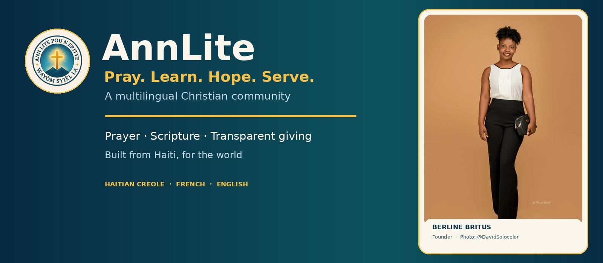
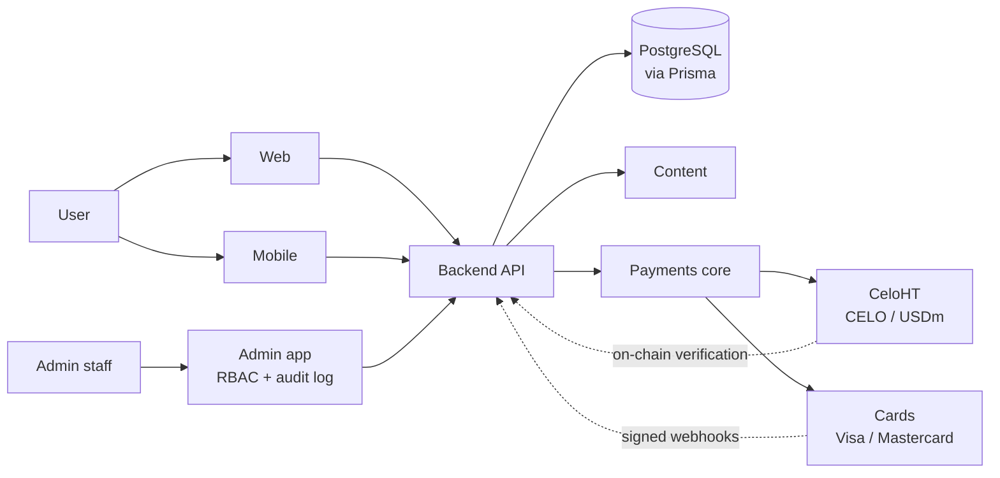

<div align="center">




# AnnLite

### Pray. Learn. Hope. Serve.
*Priye. Aprann. Espere. Sèvi.*

A Christian platform for **prayer, Bible reading, reflection and transparent charitable giving** 
in Haitian Creole, French and English.

[](https://github.com/AnnLite/AnnLite/actions/workflows/ci.yml)
[](https://github.com/AnnLite/AnnLite/actions/workflows/codeql.yml)
[](LICENSE)
[](#status)
[](CONTRIBUTING.md)

[Website](https://annlite.com/) · [GitHub Pages](https://annlite.github.io/Annlite/) · [Architecture](docs/architecture/README.md) · [Payments](docs/payments/README.md) · [Roadmap](ROADMAP.md) · [Security](SECURITY.md) · [Contributing](CONTRIBUTING.md)

</div>

---

## Table of contents
[Mission](#mission) · [Features](#features) · [Payments](#payments) · [Architecture](#architecture) · [Repository layout](#repository-layout) · [Getting started](#getting-started) · [Testing](#testing) · [Security](#security) · [Status](#status) · [Roadmap](#roadmap) · [Founder](#founder) · [Contributing](#contributing) · [License](#license)

## Mission
AnnLite helps people **pray, read Scripture, grow spiritually and give transparently** to support vulnerable children, orphans and vulnerable elders — built from Haiti, for the world.

> **Our ethical principle:** AnnLite never promises salvation or a place in heaven in exchange for using the platform or donating.

## Features
| Area | What it covers |
|---|---|
| 🙏 Prayer & reflections | Christian prayers and reflections with an editorial publishing workflow |
| 📖 Bible & education | Scripture reading and learning content (only where legally permitted) |
| 🤝 Charity | Charity projects, organizations and beneficiaries |
| 🔍 Transparency | Public donation feed and on-chain verification for crypto gifts |
| 🌍 Multilingual | Haitian Creole · Français · English |
| 🛡️ Administration | Role-based admin dashboard with audit logging |

## Payments
AnnLite is designed for two payment channels behind one server-authoritative backend contract. **Neither provider is connected and AnnLite is not accepting donations yet.**

| Channel | Location | Notes |
|---|---|---|
| **CeloHT dApp** — CELO, USDm | [`payments/celoht`](payments/celoht) | Planned integration. Production verification is not connected. CeloHT is an *integration*, not AnnLite's identity. |
| **Visa / Mastercard** | [`payments/cards`](payments/cards) | Planned through a compliant provider. Card payments are not available and AnnLite never collects card details. |
| **Shared core** | [`payments/core`](payments/core) | Payment state machine, webhook HMAC verification with replay protection, idempotency, on-chain donation verification. **8/8 tests passing.** |

**Golden rule:** a client-side "payment succeeded" message is never proof of payment.

## Architecture

Only the **backend** talks to the database. Frontends never hold secrets. See [docs/architecture](docs/architecture/README.md) and [ADR 0001](docs/architecture/adr/0001-monorepo.md).

## Repository layout
```
apps/        web · mobile · admin
backend/     central API (auth, donations, charity, content, payments webhooks)
database/    schema, migrations, seeds
content/     prayers, reflections, bible, devotional, translations
payments/    core · celoht · cards
design-system/  shared UI + brand assets
security/    threat model & policies
infrastructure/ deployment, monitoring, backups
tests/       unit · integration · e2e · payments · security · contracts
scripts/     tooling (incl. legacy import with Git history)
docs/        architecture · development · deployment · security · payments · governance
```

## Getting started
**Requirements:** Node ≥ 22, pnpm ≥ 9, Git.
```bash
git clone https://github.com/AnnLite/AnnLite.git && cd AnnLite
cp .env.example .env          # never commit real secrets
pnpm install
pnpm lint
pnpm typecheck
pnpm test
pnpm build
pnpm --filter @annlite/web dev
```
Open the local Vite URL printed by the dev command to try the web experience.
Quick check of the payment core without installing anything:
```bash
cd payments/core && npm test
```

## Testing
| Suite | Status |
|---|---|
| `apps/web` (navigation, Bible search, local prayer journal, quiz, charity states, accessibility) | ✅ 14/14 passing |
| `payments/core` (state machine, webhooks, idempotency, CELO/USDm verification) | ✅ 8/8 passing, typecheck clean |
| mobile · admin · backend · database · production payment flows | ⏳ pending legacy imports and provider setup |

## Security
Server-authoritative payments, signed webhooks with timestamp tolerance, idempotency, RBAC, audit logging, no secrets in Git. Report vulnerabilities **privately** — see [SECURITY.md](SECURITY.md).

## Status
**Pre-production.** Be aware:
- No live card provider is connected yet.
- The Celo smart contract is **unaudited — not for mainnet**.
- The web experience in `apps/web` is available as a local-first preview. Its private notes and progress stay in the current browser; they are not synced to a server.
- Mobile, admin, backend, database, and provider integrations remain placeholders until legacy code is reviewed and imported with `scripts/import-legacy.sh` (Git history preserved). No donations or live charity projects are currently presented. See [migration map](docs/governance/MIGRATION.md).

## Roadmap
See [ROADMAP.md](ROADMAP.md).

## Founder
AnnLite is a project founded by **Berline Britus**.


*Photo credit: @DavidSolocolor.*

## Contributing
Contributions are welcome — read [CONTRIBUTING.md](CONTRIBUTING.md) and the [Code of Conduct](CODE_OF_CONDUCT.md).

## License
[MIT](LICENSE) © 2026 Berline Britus / AnnLite
