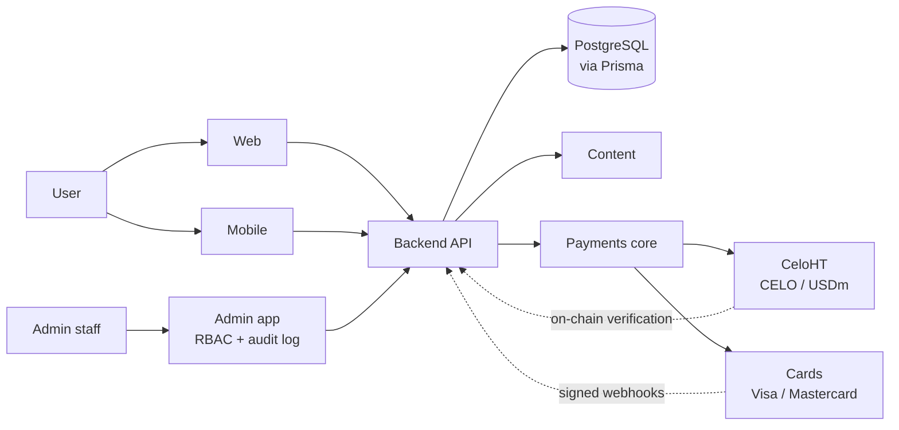

<div align="center">


# AnnLite

### Pray. Learn. Hope. Serve.
*Priye. Aprann. Espere. Sèvi.*

A Christian platform for **prayer, Bible reading, reflection and transparent charitable giving** 
in Haitian Creole, French and English.

[](https://github.com/AnnLite/AnnLite/actions/workflows/ci.yml)
[](https://github.com/AnnLite/AnnLite/actions/workflows/codeql.yml)
[](LICENSE)
[](#status)
[](CONTRIBUTING.md)

[Website](https://annlite.com) · [Architecture](docs/architecture/README.md) · [Payments](docs/payments/README.md) · [Roadmap](ROADMAP.md) · [Security](SECURITY.md) · [Contributing](CONTRIBUTING.md)

</div>

---

## Table of contents
[Mission](#mission) · [Features](#features) · [Payments](#payments) · [Architecture](#architecture) · [Repository layout](#repository-layout) · [Getting started](#getting-started) · [Testing](#testing) · [Security](#security) · [Status](#status) · [Roadmap](#roadmap) · [Founder](#founder) · [Contributing](#contributing) · [License](#license)

## Mission
AnnLite helps people **pray, read Scripture, grow spiritually and give transparently** to support vulnerable children, orphans and vulnerable elders — built from Haiti, for the world.

> **Our ethical principle:** AnnLite never promises salvation or a place in heaven in exchange for using the platform or donating.

## Features
| Area | What it covers |
|---|---|
| 🙏 Prayer & reflections | Christian prayers and reflections with an editorial publishing workflow |
| 📖 Bible & education | Scripture reading and learning content (only where legally permitted) |
| 🤝 Charity | Charity projects, organizations and beneficiaries |
| 🔍 Transparency | Public donation feed and on-chain verification for crypto gifts |
| 🌍 Multilingual | Haitian Creole · Français · English |
| 🛡️ Administration | Role-based admin dashboard with audit logging |

## Payments
AnnLite supports two payment channels behind one server-authoritative backend contract:

| Channel | Location | Notes |
|---|---|---|
| **CeloHT dApp** — CELO, USDm | [`payments/celoht`](payments/celoht) | Blockchain flow, verified on-chain by the backend. CeloHT is an *integration*, not AnnLite's identity. |
| **Visa / Mastercard** | [`payments/cards`](payments/cards) | Through a card provider. AnnLite never stores raw card data. |
| **Shared core** | [`payments/core`](payments/core) | Payment state machine, webhook HMAC verification with replay protection, idempotency, on-chain donation verification. **7/7 tests passing.** |

**Golden rule:** a client-side "payment succeeded" message is never proof of payment.

## Architecture

Only the **backend** talks to the database. Frontends never hold secrets. See [docs/architecture](docs/architecture/README.md) and [ADR 0001](docs/architecture/adr/0001-monorepo.md).

## Repository layout
```
apps/        web · mobile · admin
backend/     central API (auth, donations, charity, content, payments webhooks)
database/    schema, migrations, seeds
content/     prayers, reflections, bible, devotional, translations
payments/    core · celoht · cards
design-system/  shared UI + brand assets
security/    threat model & policies
infrastructure/ deployment, monitoring, backups
tests/       unit · integration · e2e · payments · security · contracts
scripts/     tooling (incl. legacy import with Git history)
docs/        architecture · development · deployment · security · payments · governance
```

## Getting started
**Requirements:** Node ≥ 22, pnpm ≥ 9, Git.
```bash
git clone https://github.com/AnnLite/AnnLite.git && cd AnnLite
cp .env.example .env          # never commit real secrets
pnpm install
pnpm test
```
Quick check of the payment core without installing anything:
```bash
cd payments/core && npm test
```

## Testing
| Suite | Status |
|---|---|
| `payments/core` (state machine, webhooks, idempotency, CELO/USDm verification) | ✅ 7/7 passing, typecheck clean |
| web · mobile · admin · backend · database · end-to-end payment flows | ⏳ pending legacy code import |

## Security
Server-authoritative payments, signed webhooks with timestamp tolerance, idempotency, RBAC, audit logging, no secrets in Git. Report vulnerabilities **privately** — see [SECURITY.md](SECURITY.md).

## Status
**Pre-production.** Be aware:
- No live card provider is connected yet.
- The Celo smart contract is **unaudited — not for mainnet**.
- Legacy application code is imported with `scripts/import-legacy.sh` (Git history preserved); until then `apps/*`, `backend` and `database` are placeholders. See [migration map](docs/governance/MIGRATION.md).

## Roadmap
See [ROADMAP.md](ROADMAP.md).

## Founder
AnnLite is a project founded by **Berline Britus**.


*Photo credit: @DavidSolocolor.*

## Contributing
Contributions are welcome — read [CONTRIBUTING.md](CONTRIBUTING.md) and the [Code of Conduct](CODE_OF_CONDUCT.md).

## License
[MIT](LICENSE) © 2026 Berline Britus / AnnLite
